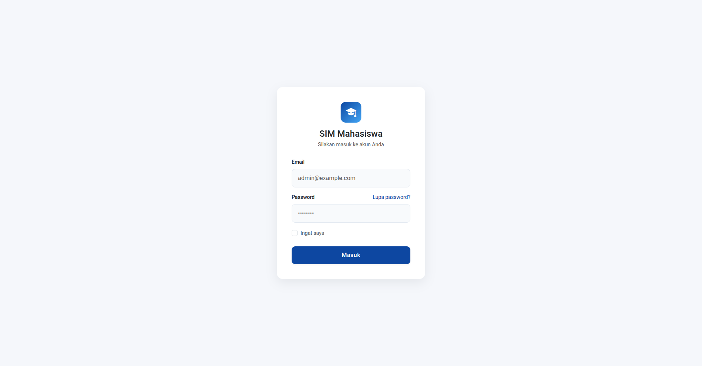
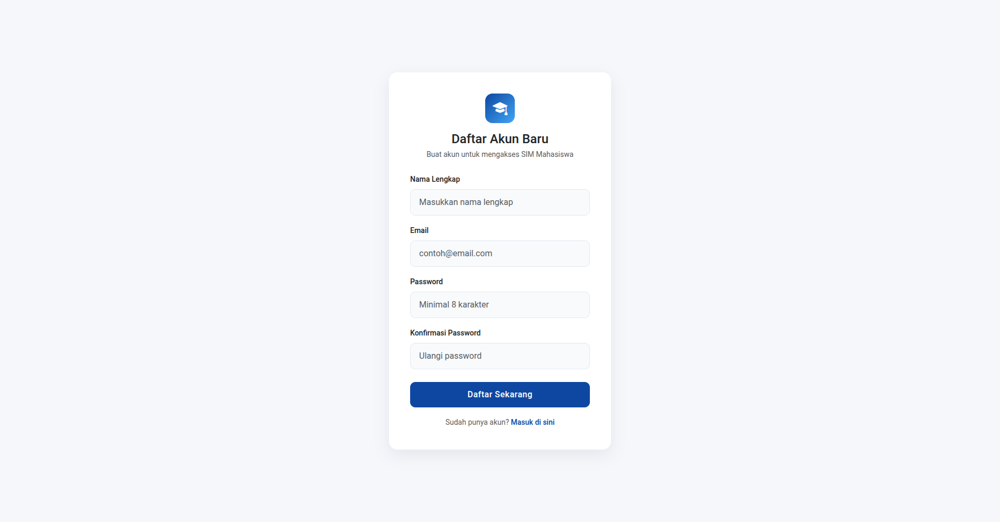
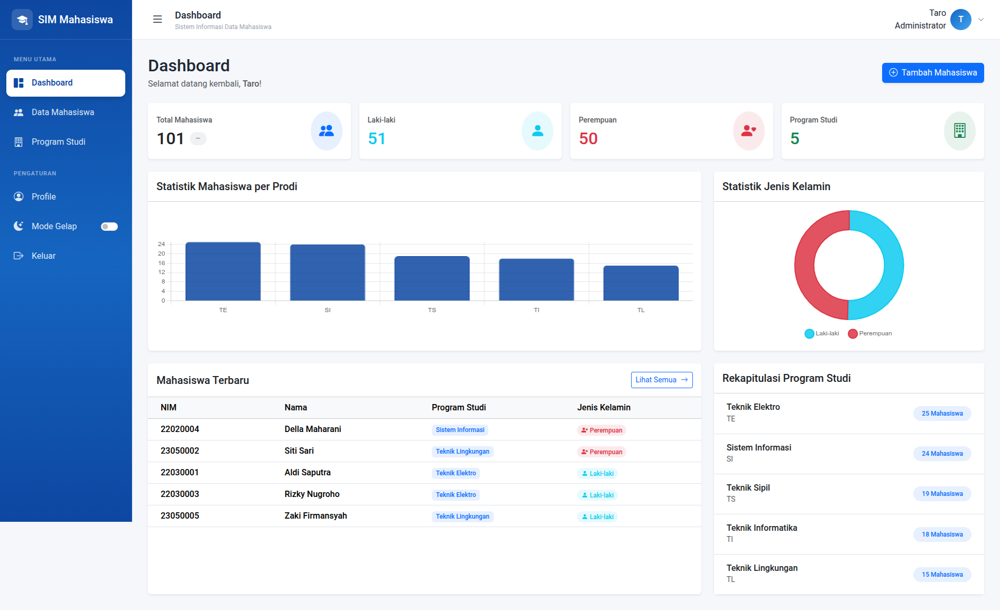
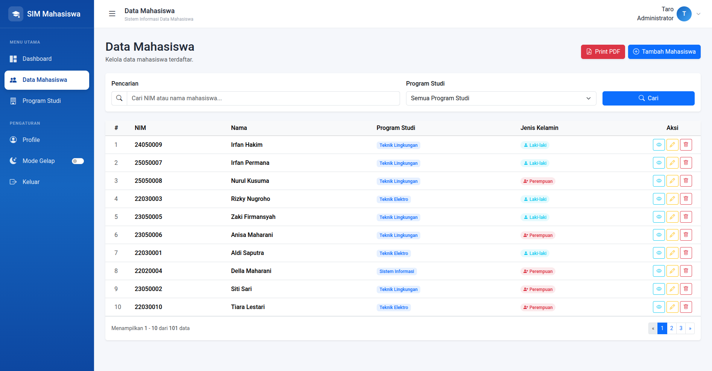
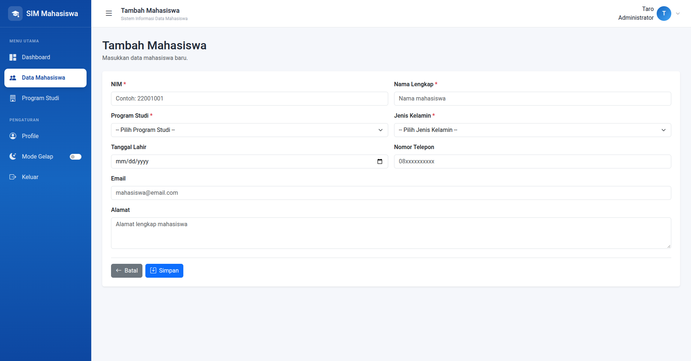
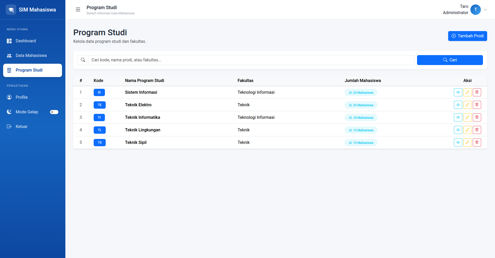
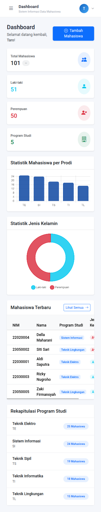

# SIM Mahasiswa — Sistem Informasi Data Mahasiswa

Mini project Laravel untuk mengelola data mahasiswa dan program studi, dikerjakan mengikuti modul **Mini Project Laravel 11 — Sistem Informasi Data Mahasiswa**.

Alur aplikasi:

```
Login → Dashboard → Data Mahasiswa (CRUD, Pencarian, Filter) → Data Prodi → Logout
```

> **Status:** progress sampai **STEP 16 — Sidebar + Topbar + Responsive Layout** (± halaman 220 modul).

---

## 👥 Anggota Kelompok

| No | Nama | NIM |
|----|------|-----|
| 1  | __Taro__| __202412023__ | 
| 2  | _Firman_ | _202412012_ |
| 3  | _Zaldy_ | _202412040_ | 
| 4 | _Ninda_ | _202412029_ |
| 5  | _Yovitha_ | _202412044_ | 

---

## 🛠️ Teknologi

| Komponen | Versi / Keterangan |
|----------|--------------------|
| Laravel | 13.33 (modul memakai Laravel 11; kode tetap kompatibel) |
| PHP | 8.4 |
| Composer | 2.8 |
| Node.js | 26 |
| Database | Supabase|
| Autentikasi | Laravel Breeze |
| Tampilan aplikasi | Bootstrap 5.3 + Bootstrap Icons (CDN) |
| Tampilan login/register | Tailwind CSS (bawaan Breeze, via Vite) |
| Grafik dashboard | Chart.js |
| Lainnya | Eloquent ORM, Resource Controller, Form Validation |

---

## ✅ Progress Pengerjaan

| Step | Materi | Status |
|------|--------|--------|
| 1 | Membuat project Laravel | ✅ Selesai |
| 2 | Membuat database | ✅ Selesai |
| 3 | Konfigurasi `.env` | ✅ Selesai |
| 4 | Install Laravel Breeze | ✅ Selesai |
| 5 | Migration (`prodis`, `mahasiswas`) | ✅ Selesai |
| 6 | Model `Prodi` dan `Mahasiswa` | ✅ Selesai |
| 7 | Seeder Program Studi | ✅ Selesai |
| 8 | Relasi model (Prodi → Mahasiswa) | ✅ Selesai |
| 9 | Controller (`Dashboard`, `Mahasiswa`, `Prodi`) | ✅ Selesai |
| 10 | Route | ✅ Selesai |
| 11 | Layout utama | ✅ Selesai |
| 12 | Dashboard | ✅ Selesai |
| 13 | CRUD Program Studi | ✅ Selesai |
| 14 | CRUD Data Mahasiswa (search, filter, pagination, validasi) | ✅ Selesai |
| 15 | Dashboard dinamis (statistik + grafik) | ✅ Selesai |
| 16 | Sidebar + Topbar + Responsive Layout | ✅ Selesai |
| 17 | Profil User + Authentication | ✅ Selesai |
| 18 | Mempercantik halaman Login & Register | ✅ Selesai |
| 19 | Seeder + Factory data dummy | ✅ Selesai |
| 20 | Final polish UI | ✅ Selesai |
| 21 | Print PDF data mahasiswa | ⏳ Belum |

---

## ✨ Fitur yang Sudah Berjalan

**Autentikasi** (Laravel Breeze)
- Register, login, logout
- Semua halaman data dilindungi middleware `auth`

**Dashboard**
- Total mahasiswa, total laki-laki, total perempuan, total program studi
- Tabel 5 mahasiswa terbaru
- Jumlah mahasiswa per program studi (grafik Chart.js)

**Data Mahasiswa**
- Tambah, lihat detail, edit, hapus (CRUD)
- Pencarian berdasarkan NIM atau nama
- Filter berdasarkan program studi
- Pagination 10 data per halaman (pencarian/filter tetap terbawa saat pindah halaman)
- Validasi input (NIM unik, jenis kelamin, email, prodi wajib ada)

**Program Studi**
- Tambah, lihat detail (beserta daftar mahasiswanya), edit, hapus
- Pencarian berdasarkan kode, nama prodi, atau fakultas
- Prodi yang masih memiliki mahasiswa tidak bisa dihapus

**Tampilan (STEP 16)**
- Sidebar dengan menu aktif otomatis
- Topbar dengan informasi user
- Notifikasi sukses, error, dan validasi
- Responsive untuk layar mobile

---

## 🗄️ Struktur Database

```
prodis (1) ──────< (banyak) mahasiswas
```

**prodis**

| Kolom | Keterangan |
|-------|------------|
| id | Primary key |
| kode_prodi | Unik, contoh: `TI` |
| nama_prodi | Contoh: Teknik Informatika |
| fakultas | Nullable |
| created_at, updated_at | Timestamp |

**mahasiswas**

| Kolom | Keterangan |
|-------|------------|
| id | Primary key |
| nim | Unik |
| nama | |
| jenis_kelamin | `Laki-laki` / `Perempuan` |
| tanggal_lahir | Nullable |
| alamat | Nullable |
| telepon | Nullable |
| email | Nullable |
| prodi_id | Foreign key → `prodis.id` |
| created_at, updated_at | Timestamp |

Relasi Eloquent:
- `Prodi::mahasiswas()` → `hasMany`
- `Mahasiswa::prodi()` → `belongsTo`

---

## 🔗 Daftar Route Utama

| Method | URL | Nama Route | Keterangan |
|--------|-----|------------|------------|
| GET | `/dashboard` | `dashboard` | Halaman dashboard |
| GET | `/mahasiswa` | `mahasiswa.index` | Daftar mahasiswa |
| GET | `/mahasiswa/create` | `mahasiswa.create` | Form tambah |
| POST | `/mahasiswa` | `mahasiswa.store` | Simpan data |
| GET | `/mahasiswa/{mahasiswa}` | `mahasiswa.show` | Detail |
| GET | `/mahasiswa/{mahasiswa}/edit` | `mahasiswa.edit` | Form edit |
| PUT/PATCH | `/mahasiswa/{mahasiswa}` | `mahasiswa.update` | Update data |
| DELETE | `/mahasiswa/{mahasiswa}` | `mahasiswa.destroy` | Hapus data |
| GET | `/prodi` | `prodi.index` | Daftar program studi |
| … | `/prodi/...` | `prodi.*` | CRUD lengkap (resource) |

Daftar lengkap: `php artisan route:list --except-vendor`

---

## 📁 Struktur Folder Penting

```
app/
├── Http/Controllers/
│   ├── DashboardController.php
│   ├── MahasiswaController.php
│   └── ProdiController.php
└── Models/
    ├── Mahasiswa.php
    ├── Prodi.php
    └── User.php
database/
├── migrations/
│   ├── ..._create_prodis_table.php
│   └── ..._create_mahasiswas_table.php
└── seeders/
    ├── DatabaseSeeder.php
    └── ProdiSeeder.php
resources/views/
├── layouts/          # layout utama (sidebar + topbar)
├── dashboard.blade.php
├── mahasiswa/        # index, create, edit, show
└── prodi/            # index, create, edit, show
routes/
├── web.php
└── auth.php
```

---

## 🚀 Cara Menjalankan

**Kebutuhan:** PHP ≥ 8.3, Composer, Node.js, dan MySQL.

1. Clone repository

   ```bash
   git clone https://github.com/clarity69/SIM-MAHASISWA.git
   cd sim-mahasiswa
   ```

2. Install dependency

   ```bash
   composer install
   npm install
   ```

3. Salin file environment dan buat app key

   ```bash
   cp .env.example .env
   php artisan key:generate
   ```

4. Atur koneksi database di `.env`

   ```env
    DB_CONNECTION=pgsql
    DB_HOST=db.xxxxxxxx.supabase.co
    DB_PORT=5432
    DB_DATABASE=postgres
    DB_USERNAME=postgres
    DB_PASSWORD=password-supabase-kamu
    DB_SSLMODE=require
   ```

5. Jalankan migration dan seeder (data prodi awal: TI, SI, TE)

   ```bash
   php artisan migrate --seed
   ```

6. Build asset dan jalankan aplikasi

   ```bash
   npm run build
   php artisan serve
   ```

7. Buka `http://127.0.0.1:8000`, lalu **register** akun baru untuk masuk ke dashboard.

---

## 📸 Screenshot

| Halaman | Screenshot |
|---------|------------|
| Login |  |
| Register|  |
| Dashboard |  |
| Data Mahasiswa |  |
| Tambah Mahasiswa |  |
| Program Studi |  |
| Tampilan Mobile |  |

---

## 📝 Catatan Pengerjaan

- Modul ditulis untuk **Laravel 11**, sedangkan project ini memakai **Laravel 13**. Perbedaan utama yang ditemui: PHP minimal 8.3.
- Halaman aplikasi memakai Bootstrap 5 dari CDN, sementara halaman login/register bawaan Breeze tetap memakai Tailwind CSS melalui Vite.
- Aturan validasi `store` dan `update` digabung ke satu method `rules()` di setiap controller agar tidak ditulis dua kali.

---

## 📌 Rencana Berikutnya

- **STEP 17** — Halaman profil user (ubah nama, email, password)
- **STEP 18** — Desain ulang halaman login & register
- **STEP 19** — Factory + seeder data dummy mahasiswa
- **STEP 20** — Final polish UI
- **STEP 21** — Cetak PDF data mahasiswa